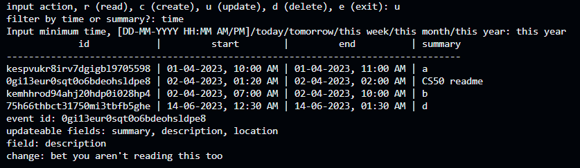

# Clinder

### Video Demo: https://www.youtube.com/watch?v=4HdLoAgK4PY

## Description:
Clinder is a command line interface for google calendar, which uses the google calendar api.

## Functionality:
There are four basic commands to this program

### 1) Create
Events can be created, with fields

:white_check_mark: summary (aka title), location, description

:x: recurrence, attendees, reminders

### 2) Read
There are a few different filters and method of displaying events:

1. display events within specific time range

2. display events for today, tomorrow, this week, this month or this year

3. display events with a specific title (aka summary)

### 3) Update
The summary, description and location of an event can be updated, one at a time

### 4) Delete
Events can be deleted in bulk

### - Calendar ID
First time inputting id

If id has been input before, it will be stored in token.json where it can be reused

### - Error prevention
There are some basic checks to prevent errors

## Things I've Learnt
- how to utilise datetime python module
- modularisation
- how to use APIs
- python loops
