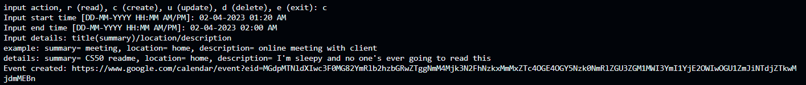
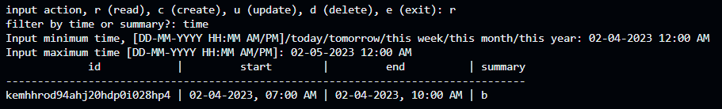
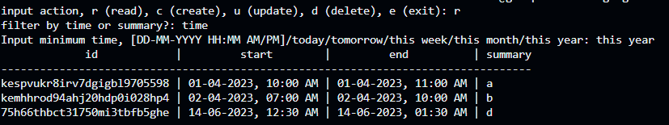
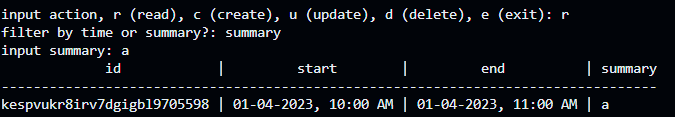
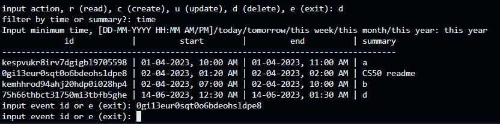
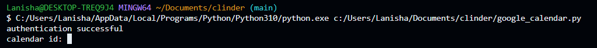
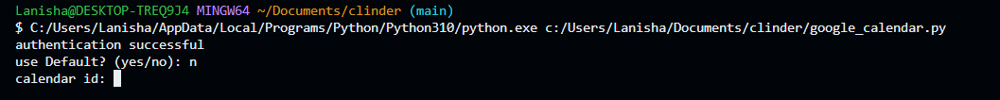

# Clinder
### Contents:
1. [Description](https://github.com/l4n1skyy/clinder/edit/main/README.md#description-1)
2. [Installation](https://github.com/l4n1skyy/clinder/edit/main/README.md#installation-1)
3. [Functionality](https://github.com/l4n1skyy/clinder/edit/main/README.md#functionality-1)

## Description:
Clinder is a command line interface for google calendar, which uses the google calendar api. Clinder can be an alternative to the google calendar website which is more interactive and visual which might make it slower. Clinder can also be convenient to those who work on the command line often and find it troublesome switching between windows.

## Installation:
1. Create a Google Cloud project
   1. https://console.cloud.google.com/projectcreate
2. Enable Google Calendar API
   1. https://console.cloud.google.com/flows/enableapi?apiid=calendar-json.googleapis.com
3. Configure OAuth
   1. https://console.cloud.google.com/apis/credentials/consent
   2. type: External
   3. OAuth consent screen, just type name and email
   4. Scopes
      1. Click rows per page, display 100
      2. Select All
   5. Test Users, add your email
4. Create Credentials
   1. Credentials -> Create Credentials -> OAuth Client ID
   2. Application Type: Desktop App
   3. Download JSON
   4. rename to credentials.json 
   5. copy paste to this folder
5. Install required modules in powershell/cmd
   1. pip install tzdata
   2. pip install --upgrade google-api-python-client google-auth-httplib2 google-auth-oauthlib
6. Input Calendar ID
   1. Settings -> Integrate Calendar -> Calendar ID

## Functionality:
There are four basic operations in this program, which is to create events, read (display) events, update events and delete events.

### 1) Create
Events can be created, with fields

:white_check_mark: summary (aka title), location, description, time

:x: recurrence, attendees, reminders

### 2) Read
There are a few different filters and method of displaying events:

1. display events within specific time range

2. display events for today, tomorrow, this week, this month or this year

3. display events with a specific title (aka summary)

### 3) Update
The summary, description and location of an event can be updated, one at a time

### 4) Delete
Events can be deleted in bulk

### - Calendar ID
First time inputting id

If id has been input before, it will be stored in token.json where it can be reused

